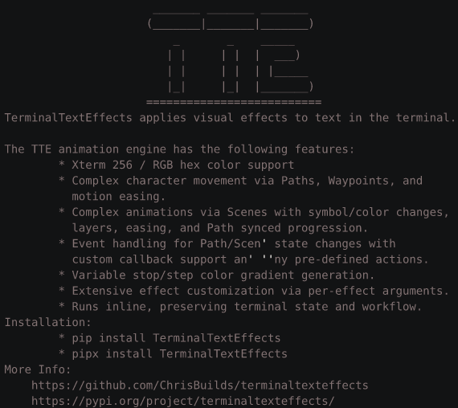

# Burn



## Quick Start

``` py title="burn.py"
from varoascii.effects.effect_burn import Burn

effect = Burn("YourTextHere")
with effect.terminal_output() as terminal:
    for frame in effect:
        terminal.print(frame)
```

::: varoascii.effects.effect_burn
