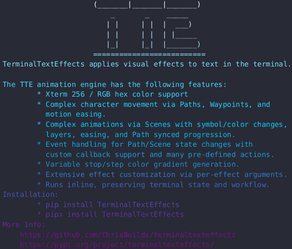

# Highlight



## Quick Start

``` py title="highlight.py"
from varoascii import Gradient
from varoascii.effects.effect_highlight import Highlight

effect = Highlight("YourTextHere")

with effect.terminal_output() as terminal:
    effect.effect_config.final_gradient_direction = Gradient.Direction.HORIZONTAL
    for frame in effect:
        terminal.print(frame)
```

::: varoascii.effects.effect_highlight
