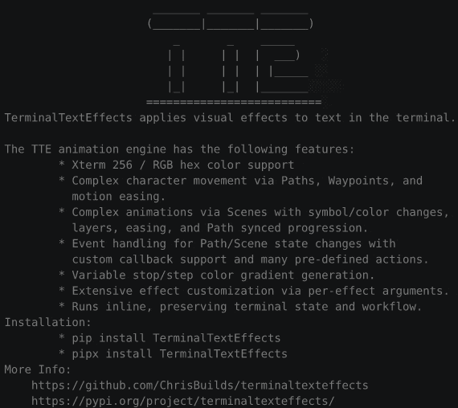

# Smoke



## Quick Start

``` py title="smoke.py"
from varoascii.effects import Smoke

effect = Smoke("YourTextHere")
with effect.terminal_output() as terminal:
    for frame in effect:
        terminal.print(frame)
```

::: varoascii.effects.effect_smoke
